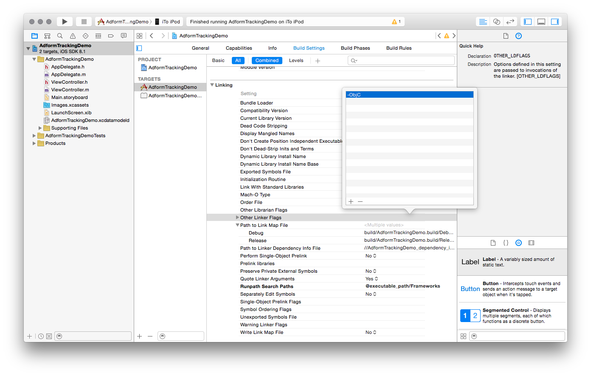
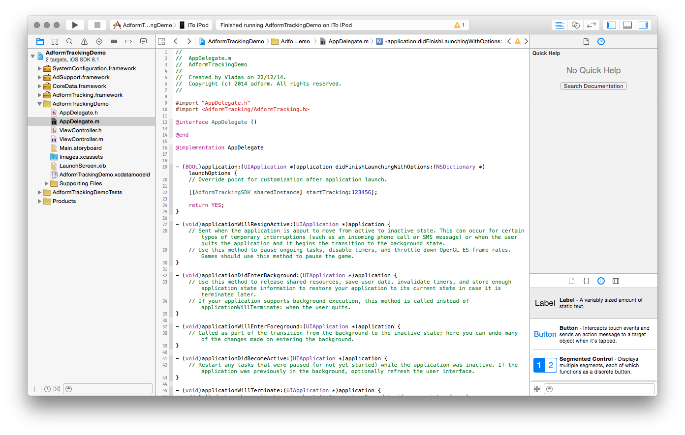
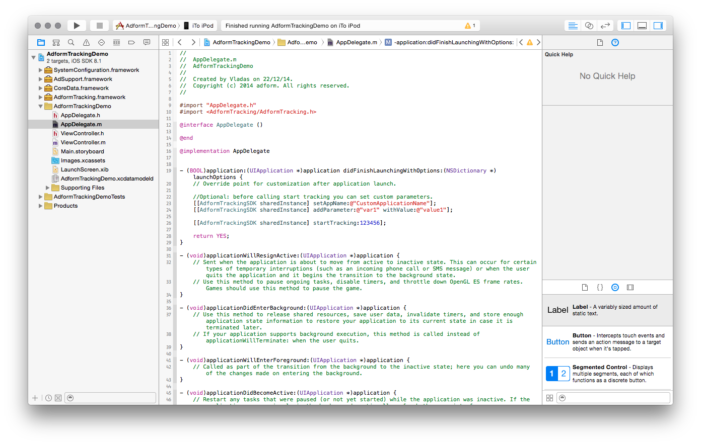
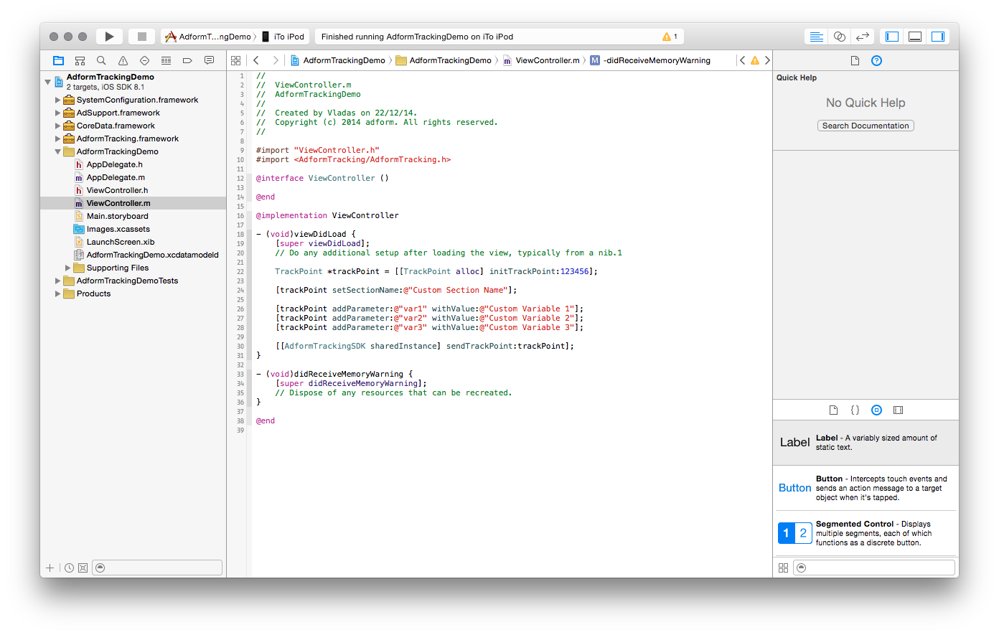

# Getting Started

When you run mobile campaigns, boost of new app installs are often one of the main goals. We are happy to announce that today we are launching app installs solution for iOS and Android devices. Easy to install SDK will enable campaign app installs tracking and reporting in Adform platform without need to deal with 3rd party SDKs and invest tons of time into that.

## 1. General Info

The use of Adform Tracking SDK requires the following:

* Xcode 5.0 or later.
* iOS SDK 7.0 or later.
* Requires deployment target 6.0 or later.
* Requires ARC to be enabled. 

## 2. Integration

### 2.1. Using CocoaPods

Adform Tracking SDK is now available via CocoaPods. CocoaPods is a very popular Objective-C dependency management tool. 

* To use CocoaPods, you should first install the CocoaPods Ruby Gem (CocoaPods is built with Ruby):

````
$ sudo gem install cocoapods
````

* Next, you need to create a `Podfile`, which describes what dependencies you project has. This file should be placed in your project directory. 

````
$ pod init
````

* Next, edit `Podfile` and add the platform identifier and the list of libraries you want to use in the project. 

````
platform: ios

pod 'AdformTracking'
````

* Finally, you have to install the selected libraries.

````
pod install
````
Thats it!

For more information about CocoaPods visit [CocoaPods site](http://cocoapods.org/about).


### 2.2. Manual

* Download latest build version of Adform Tracking SDK.
* Drag **AdformTracking.framework** to your project.


* When asked select **Copy items into destination group's folder**.


* Go to your application target’s configuration > General > Linked Frameworks and Libraries section and add these frameworks to your project:

   * **AdSupport.framework**
   * **CoreData.framework**
   * **SystemConfiguration.framework**
   * **CoreTelephony.framework**


* Go to your application target’s configuration > Build settings > Linking > Other Linker Flags, and set **-ObjC** flag.



## 3. Basic Adform Tracking SDK implementation

* Import `AdformTracking/AdformTracking.h` in `AppDelegate.h`

* In `application:didFinishLaunchingWithOptions:` method call `startTracking:` method with your Client Tracking ID. This method should be called only one time, when app starts.

````objc
    [[AdformTrackingSDK sharedInstance] startTracking:Tracking_ID];
````

Thats it! You are ready to go. Now in Adform system will be created default tracking points (Download, Start, Update), when they will be triggered for the first time.



* Optionally you can set custom application name and custom variables before calling `startTracking:`.

````objc
    [[AdformTrackingSDK sharedInstance] setAppName:@"CustomApplicationName"];
    [[AdformTrackingSDK sharedInstance] addParameter:@"var1" withValue:@"value1"];
    
    [[AdformTrackingSDK sharedInstance] startTracking:Tracking_ID];
````



## 4. Custom Adform Tracking SDK implementations

* For sending custom tracking events manually you need to import `AdformTracking/AdformTracking.h` in any class you want to send events from, in provided example we use `ViewController.h`.

* Create a `TrackPoint` instance with your client tracking id, set tracking point name, custom variables and send the tracking point. 

````objc
    TrackPoint *trackPoint = [[TrackPoint alloc] initTrackPoint:Tracking_ID];
    
    [trackPoint setSectionName:@"Custom Tracking Point Name"];
    
    [trackPoint addParameter:@"var1" withValue:@"Custom Variable 1"];
    [trackPoint addParameter:@"var2" withValue:@"Custom Variable 2"];
    [trackPoint addParameter:@"var3" withValue:@"Custom Variable 3"];
    
    [[AdformTrackingSDK sharedInstance] sendTrackPoint:trackPoint];
````



To logicaly group tracking points you can set separate app names for each custom tracking point. This would allow to use app name together with custom section name.

````objc
    TrackPoint *trackPoint = [[TrackPoint alloc] initTrackPoint:Tracking_ID];
    
    [trackPoint setSectionName:@"Custom Tracking Point Name"];
    [trackPoint setAppName:@"Custom_app_name-Section_name"];
    
    [[AdformTrackingSDK sharedInstance] sendTrackPoint:trackPoint];
````

Also it is posible to send additional product variables information with tracking points. This feature is very useful in e-cmomerce apps. To do so you have two options, first use `addProduct:` method and add products to the trackpoint one at a time, second use `setProducts:` method and set an array of products. Either way you must set `AFProduct` objects.

````objc
    TrackPoint *trackPoint = [[TrackPoint alloc] initTrackPoint:Tracking_ID];
    [trackPoint setSectionName:@"Custom Tracking Point Name"];
    
    AFProduct *product = [[AFProduct alloc] initWithCategoryName:@"Product category name"
                                                      categoryId:@"Product category id"
                                                     productName:@"Product name"
                                                       productId:@"Product id"
                                                          weight:@"Product weight"
                                                            step:@"Product step"
                                                    productSales:@"Product sales"
                                                    productCount:@"Product count"
                                                          custom:@"Custom product information"];
    [trackPoint addProduct:product];
    
    [trackPoint addParameter:@"var1" withValue:@"Custom Variable 1"];
    [trackPoint addParameter:@"var2" withValue:@"Custom Variable 2"];
    [[AdformTrackingSDK sharedInstance] sendTrackPoint:trackPoint];
```` 

If want to send only part of available product data, you can avoid using big init method by setting those properties manually after creating an object with default initializer.
````objc
    TrackPoint *trackPoint = [[TrackPoint alloc] initTrackPoint:Tracking_ID];

    AFProduct *product = [AFProduct new];
    product.productName = @"My Product Name";
    [trackPoint addProduct:product];
```` 

## 5. Limit tracking

You can disable the Adform Tracking SDK from tracking any events by calling `setEnabled:` with parameter `NO`. This setting is remembered between application launches. By default tracking is enabled.

````objc
    [[AdformTrackingSDK sharedInstance] setEnabled:NO];
```` 

You can check if tracking is enabled by calling `isEnabled` method.
 

## 6. Deeplink tracking

Adform Tracking SDK uses deep-link tracking to attribute part of Facebook events. You should implement it if you are going to use our SDK for Facebook tracking.

The implementation is very simple, you just have to call `AdformTrackingSDK` method `applicationOpenUrl:sourceApplication:` in your `AppDelegate` class's method `application:openURL:sourceApplication:annotation:` and pass url and sourceApplication parameters.

````objc
- (BOOL )application:(UIApplication *)application openURL:(NSURL *)url sourceApplication:(NSString *)sourceApplication annotation:(id)annotation {
    
    return [[AdformTrackingSDK sharedInstance] applicationOpenUrl:url
                                                sourceApplication:sourceApplication];
}
````


## 7. SIM card state tracking

Adform Tracking SDK allows you to track user device SIM card state. This feature allows you to see if a user device has a SIM card inserted into it. 

This feature is turned off by default, therefore if you want to use it, you need to enable it. To do so you just need to use the `setSendSimCardStateEnabled:` method.

````objc
    [[AdformTrackingSDK sharedInstance] setSendSimCardStateEnabled:true];
    [[AdformTrackingSDK sharedInstance] startTracking:Tracking_ID];
````

