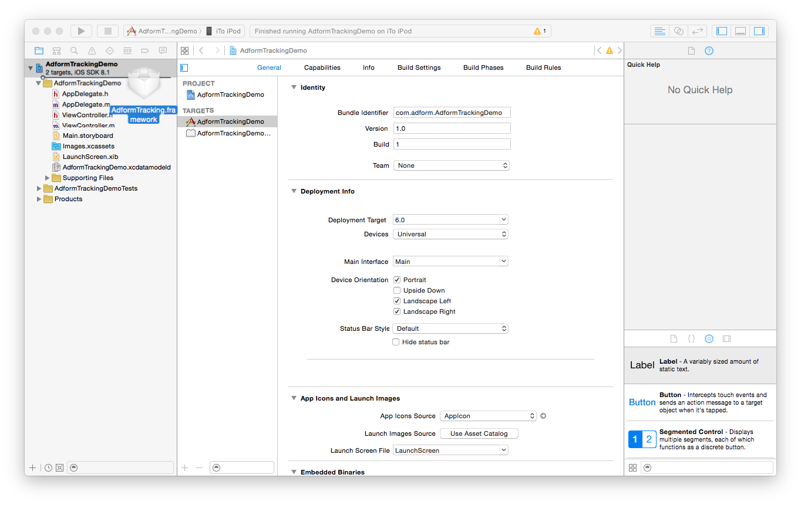
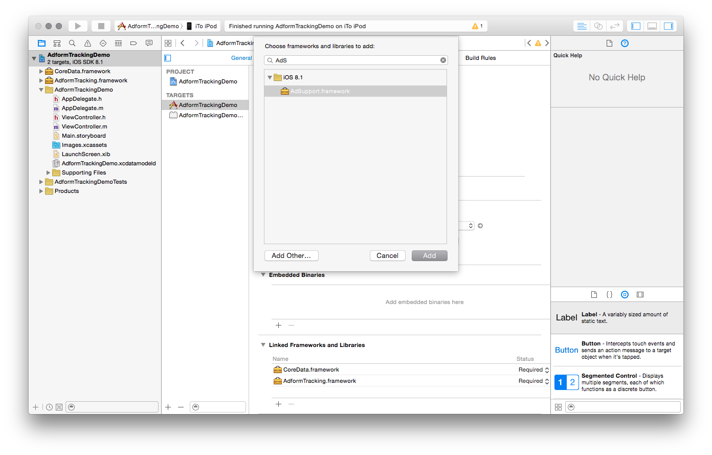

# Getting Started

When you run mobile campaigns, boost of new app installs are often one of the main goals. Our easy to install Tracking SDK will enable campaign app installs tracking and reporting in Adform platform without need to deal with 3rd party SDKs and invest tons of time into that.


## 1. General Info

The use of Adform Tracking SDK requires the following:

* Xcode 7.0 or later.
* iOS SDK 7.0 or later.
* Requires deployment target 7.0 or later.
* Requires ARC to be enabled. 

[**Please folow Migration guide below if you are updating SDK to version 1.0.**](https://github.com/adform/adform-tracking-ios-sdk#upgrading-to-10)

### 1.1. Plugins

Tracking SDK is also available on these platforms:

* ***[Unity](https://github.com/adform/adform-tracking-sdk-unity-plugin)***
* ***[Xamarin](https://github.com/adform/adform-tracking-sdk-xamarin/wiki/xamarin-ios-integration-guide)*** 

## 2. Integration

### 2.1. Using CocoaPods

Adform Tracking SDK is now available via CocoaPods. CocoaPods is a very popular Objective-C dependency management tool. 

* To use CocoaPods, you should first install the CocoaPods Ruby Gem (CocoaPods is built with Ruby):

````
$ sudo gem install cocoapods
````

* Next, you need to create a `Podfile`, which describes what dependencies you project has. This file should be placed in your project directory. 

````
$ pod init
````

* Next, edit `Podfile` and add the platform identifier and the list of libraries you want to use in the project. 

````
platform: ios

pod 'AdformTracking'
````

* Finally, you have to install the selected libraries.

````
pod install
````
Thats it!

For more information about CocoaPods visit [CocoaPods site](http://cocoapods.org/about).


### 2.2. Manual

* Download latest build version of Adform Tracking SDK.
* Drag **AdformTracking.framework** to your project.



* When asked select **Copy items into destination group's folder**.


* Go to your application target’s configuration > General > Linked Frameworks and Libraries section and add these frameworks to your project:

   * **AdSupport.framework**
   * **CoreData.framework**
   * **SystemConfiguration.framework**
   * **CoreTelephony.framework**
   * **SafariServices.framework**



* Adform Tracking SDK uses Protocol Buffers - Google's data interchange format. 
Therefore you need to import Protobuf library to your project. You should use [3.0.0-beta-3.1 version](https://github.com/google/protobuf/releases/tag/v3.0.0-beta-3.1) of the library. 
Instructions on how to integrate it can be found [here](https://github.com/google/protobuf/tree/master/objectivec#building).

## 3. Basic Adform Tracking SDK implementation

* Import `AdformTracking/AdformTracking.h` in `AppDelegate.h`

* In `application:didFinishLaunchingWithOptions:` method call `startTracking:` method with your Client Tracking ID. This method should be called only one time, when app starts.

````objc
- (BOOL)application:(UIApplication *)application didFinishLaunchingWithOptions:(NSDictionary *)launchOptions {
    
    [[AdformTrackingSDK sharedInstance] startTracking:Tracking_ID];

    return YES;
}
````

Thats it! You are ready to go. Now in Adform system will see default tracking points (Download, Start, Update), when they are triggered.


* Optionally you can set custom application name and custom variables before calling `startTracking:`.

````objc
    [[AdformTrackingSDK sharedInstance] setAppName:@"CustomApplicationName"];

    AFOrder *order = [AFOrder new];
    order.firstName = @"First Name";
    order.lastName = @"Last Name";

    // You also can set other custom variables.
    [order setCustomVariable:@"var1" forKey:1];
    [order setSystemVariable:@"sysVar1" forKey:1];
    [order setNumericSystemVariable:@(123.45) forKey:1];

    [[AdformTrackingSDK sharedInstance] setOrder:order];

    [[AdformTrackingSDK sharedInstance] startTracking:TRACKING_ID];
````

## 4. Custom Adform Tracking SDK implementations

* For sending custom tracking events manually you need to import `AdformTracking/AdformTracking.h` in any class you want to send events from, in provided example we use `ViewController.h`.

* Create an `AFTrackPoint` instance with your client `Tracking_ID`. After that you can set tracking point name, custom variables and finally send the tracking point. 

* When defining variables' it's required to keep in mind, that there are different type of variables:
	* Custom variables with predefined names (orderid, currency, firstname, etc.)
	* Custom variables (var1-var10)
	* System variables (sv1-sv89)
	* Numeric system variables (svn1, svn2)

* Create a `AFTrackPoint` instance with your track point id, set custom application name, custom parameters, a.k.a. order, and send the track point.

````objc
    AFTrackPoint *trackPoint = [[AFTrackPoint alloc] initTrackPoint:TRACKING_ID];

    [trackPoint setSectionName:@"Custom Application Name"];

    AFOrder *order = [AFOrder new];
    order.orderid = @"Order ID";
    order.sale = 1234; //numeric format
    order.currency = @"Eur";
    order.orderStatus = @"Sold";
    order.firstName = @"First Name";
    order.lastName = @"Last Name";
    order.country = @"Country";
    order.address1 = @"Address 1";
    order.address2 = @"Address 2";
    order.zip = @"ZIP code";
    order.email = @"E-mail";
    order.phone = @"Phone";
    order.gender = @"Gender";
    order.ageGroup = @"Age group";
    order.basketSize = 12; //numeric format

    // You can also set other custom variables.
    [order setCustomVariable:@"Var1 value" forKey:1]; //forKey defines variable index, e.g. forKey:3 means Var3
    [order setSystemVariable:@"Sv1 value" forKey:1]; //forKey defines variable index, e.g. forKey:3 means Sv3
    [order setNumericSystemVariable:@(123.45) forKey:1]; //forKey defines variable index, e.g. forKey:2 means Svn2; Only numeric values allowed

    [trackPoint setOrder:order];

    [[AdformTrackingSDK sharedInstance] sendTrackPoint:trackPoint];
````


To logicaly group tracking points you can set separate app names for each custom tracking point. This would allow to use app name together with custom section name.

````objc
    TrackPoint *trackPoint = [[TrackPoint alloc] initTrackPoint:Tracking_ID];
    
    [trackPoint setSectionName:@"Custom Tracking Point Name"];
    [trackPoint setAppName:@"Custom_app_name-Section_name"];
    
    [[AdformTrackingSDK sharedInstance] sendTrackPoint:trackPoint];
````

## 5. Product variables

Also it is posible to send additional product variables information with tracking points. To do so you have two options, first use `addProduct:` method and add products to the trackpoint one at a time, second use `setProducts:` method and set an array of products. Either way you must set `AFProduct` objects.

````objc
    TrackPoint *trackPoint = [[TrackPoint alloc] initTrackPoint:Tracking_ID];
    [trackPoint setSectionName:@"Custom Tracking Point Name"];
    
    AFProduct *product = [[AFProduct alloc] initWithCategoryName:@"Product category name"
                                                      categoryId:@"Product category id"
                                                     productName:@"Product name"
                                                       productId:@"Product id"
                                                          weight:@"Product weight"
                                                            step:@"Product step"
                                                    productSales:@"Product sales"
                                                    productCount:@"Product count"
                                                          custom:@"Custom product information"];
    [trackPoint addProduct:product];
    
    [[AdformTrackingSDK sharedInstance] sendTrackPoint:trackPoint];
```` 
Also for same tracking point you can list more than one product variables list:

````objc
    TrackPoint *trackPoint = [[TrackPoint alloc] initTrackPoint:Tracking_ID];
    [trackPoint setSectionName:@"Custom Tracking Point Name"];
    
    AFProduct *product1 = [[AFProduct alloc] initWithCategoryName:@"Product category name"
                                                      categoryId:@"Product category id"
                                                     productName:@"Product name"
                                                       productId:@"Product id"
                                                          weight:@"Product weight"
                                                            step:@"Product step"
                                                    productSales:@"Product sales"
                                                    productCount:@"Product count"
                                                          custom:@"Custom product information"];
                                                          
    AFProduct *product2 = [[AFProduct alloc] initWithCategoryName:@"Product category name"
                                                      categoryId:@"Product category id"
                                                     productName:@"Product name"
                                                       productId:@"Product id"
                                                          weight:@"Product weight"
                                                            step:@"Product step"
                                                    productSales:@"Product sales"
                                                    productCount:@"Product count"
                                                          custom:@"Custom product information"];
    [trackPoint setProducts:@[product1, product2]];

    [[AdformTrackingSDK sharedInstance] sendTrackPoint:trackPoint];
```` 


If you want to send only part of available product data, you can avoid using big init method by setting those properties manually after creating an object with default initializer.

````objc
    TrackPoint *trackPoint = [[TrackPoint alloc] initTrackPoint:Tracking_ID];

    AFProduct *product = [AFProduct new];
    product.productName = @"My Product Name";
    [trackPoint addProduct:product];
    
    [[AdformTrackingSDK sharedInstance] sendTrackPoint:trackPoint];
```` 

## 6. Sending information to multiple clients

It is possible to send tracking information to multiple clients by defining each client's Tracking id.

In order to start tracking, please use an example below:

````objc
    [[AdformTrackingSDK sharedInstance] startTrackingWithIds:@[Tracking_ID1, Tracking_ID2, Tracking_ID3]];
````

To send custom tracking points for multiple clients, you should use `AFTrackPointsBuilder` class. It helps you create multiple trackpoints with same information, but differrent tracking id.Example bellow ilustrates how to do so:

````objc
    AFTrackPointsBuilder *trackPointBuilder = [[AFTrackPointsBuilder alloc] init];
    
    // You must set at least these properties:
    trackPointBuilder.trackPointIds = @[Tracking_ID1, Tracking_ID2, Tracking_ID3];
    trackPointBuilder.sectionName = @"Custom trackpoint";
    
    // Additionally you can set more information to track.
    trackPointBuilder.applicationName = @"Custom application name";
    trackPointBuilder.order = yourOrder;
    
    // Create trackpoints
    NSArray *trackPoints = [trackPointBuilder build];
    
    // Send trackpoints.
    [[AdformTrackingSDK sharedInstance] sendTrackPoints:trackPoints];
````

## 7. Limit tracking

You can disable the Adform Tracking SDK from tracking any events by calling `setEnabled:` with parameter `NO`. This setting is remembered between application launches. By default tracking is enabled.

````objc
    [[AdformTrackingSDK sharedInstance] setEnabled:NO];
```` 

You can check if tracking is enabled by calling `isEnabled` method.
 

## 8. Deeplink tracking

Adform Tracking SDK uses deep-link tracking to attribute part of Facebook events. You should implement it if you are going to use our SDK for Facebook tracking.

The implementation is very simple, you just have to call `AdformTrackingSDK` method `applicationOpenUrl:sourceApplication:` in your `AppDelegate` class's method `application:openURL:sourceApplication:annotation:` and pass url and sourceApplication parameters.

````objc
- (BOOL )application:(UIApplication *)application openURL:(NSURL *)url sourceApplication:(NSString *)sourceApplication annotation:(id)annotation {
    
    return [[AdformTrackingSDK sharedInstance] applicationOpenUrl:url
                                                sourceApplication:sourceApplication];
}
````

## 9. SIM card state tracking

Adform Tracking SDK allows you to track user device SIM card state. This feature allows you to see if a user device has a SIM card inserted into it. 

This feature is turned off by default, therefore if you want to use it, you need to enable it. To do so you just need to use the `setSendSimCardStateEnabled:` method.

````objc
    [[AdformTrackingSDK sharedInstance] setSendSimCardStateEnabled:true];
    [[AdformTrackingSDK sharedInstance] startTracking:Tracking_ID];
````

## 10. Security

By default AdformTracking sdk uses HTTPS protocol for network comunnications, but there is a possibility to disable it and use insecure HTTP protocol. Example below shows you how to do it.

````objc
	[[AdformTrackingSDK sharedInstance] setHTTPSEnabled:false];
````

## 11. The use of SFSafariViewController

By default Adform Tracking SDK uses a web view to send tracking information to the server,
but it is possible to enable the use of SFSafariViewController, which significantly improves tracking accuracy. Just a note, that according to Apple policies SFSafariViewController may not be hidden or obscured by other views or layers and as Tracking SDK runs in background, this could be a reason why app could be rejected in iTunes store during review. 

Example below shows how to enable SFSafariViewController:

````objc
	[[AdformTrackingSDK sharedInstance] setSafariControllerEnabled:true];
````

# Migration guide

## Upgrading to 1.0

In SDK version 1.0 was added functionality, which requires additional changes during update from older versions:
* If you are integrating SDK manually you need to add additional `SafariServices` framework dependency to your project.
* Also if you are integrating SDK manually you need to import Google Protobuf library to your project. 
Instructions on how to do it can be found [here](https://github.com/google/protobuf/tree/master/objectivec#building).
* `TrackPoint` class have been renamed to `AFTrackPoint`.
* `getParameters`, `addParameter:withValue:` and `setParameters:` methods of `AFTrackPoint` and `AdformAdvertisingSDK` classes have been deprecated. Instead of them to set custom variables to tracking points you should use `setOrder:` method and `AFOrder` class.


# Release notes

## 1.1.3

### Bug fixes

* Fixed issue when UIWebView was called from background thread;

## 1.1.3

### Bug fixes

* Fixed a typo;

## 1.1.2

### New Features

* iOS 10 support;

## 1.1.1

### New Features

* Now SDK uses Protocol Buffers v3.0.0-beta-3.1 library;

## 1.1

### New Features

* Add basket size parameter to order;

## 1.0

### New Features

* Improved app installs attribution;
* Multiple trackpoint support;

### Bug Fixes

* Minor bug fixes;


